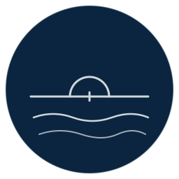

# Operational Ecology

**Operational tools for conservation.**

[operationalecology.io](https://operationalecology.io)

---

Conservation research generates more imagery, audio, and field data every year
than the people doing the work can process. The bottleneck is rarely the
question — it's the time it takes to extract the signal from data already
collected by people who already know what they are looking for.

Operational Ecology builds production machine-learning tools that close that
gap. We work with researchers, NGOs, and government agencies who already
collect the data and already understand its biology, and we ship the systems
that scale the analysis without changing the workflow the work happens in.

The biologists and technicians whose careers are devoted to these populations
are the experts. Our role is to amplify that work — never replace it, never
overshadow it. Every tool we ship is built to be **trusted with a partner's
life's work**.

## How we build

Every project carries the same commitments:

- **Honest evaluation by default.** Where ground truth is incomplete, we say
  so. Models that don't know they're uncertain don't ship; calibration,
  intervals, abstention, and per-sample diagnostics live in every result.
- **Semi-automated extension to expert workflows.** The default stance is
  triage and amplification of expert review, not autonomous replacement —
  unless and until evidence justifies otherwise.
- **Source-code consistency for every reported number.** Frozen SHAs,
  versioned datasets, run manifests, committed dependency locks.
- **A protocol entry for every material decision.** A per-project
  `PROTOCOL.md` records what was decided and why, so results can be read in
  the light of how they were produced — by reviewers, by future contributors,
  by anyone the company eventually employs.

## Current work

<table>
<tr>
<td align="center" width="33%">
  <a href="https://github.com/Operational-Ecology/Scarwatch">
     
    <strong>scarwatch</strong>
  </a> 
  Automated detection and longitudinal tracking of conspecific scarring on killer whales.
</td>
<td align="center" width="33%">
  <a href="https://github.com/Operational-Ecology/Consort">
     
    <strong>consort</strong>
  </a> 
  Encounter-aware photo-identification for socially structured wildlife populations.
</td>
<td align="center" width="33%">
  <a href="https://github.com/Operational-Ecology/Plimsoll">
     
    <strong>plimsoll</strong>
  </a> 
  Whale body-condition assessment from boat-based photo-ID imagery.
</td>
</tr>
<tr>
<td align="center" width="33%">
  <a href="https://github.com/Operational-Ecology/Pelorus">
     
    <strong>pelorus</strong>
  </a> 
  Metric position, heading, and movement of whales from monocular imagery.
</td>
<td align="center" width="33%">
  <a href="https://github.com/Operational-Ecology/Almanac">
     
    <strong>almanac</strong>
  </a> 
  Curated, versioned dataset registry. The reference book every other project resolves through.
</td>
<td align="center" width="33%">
  <a href="https://github.com/Operational-Ecology/Forge">
     
    <strong>forge</strong>
  </a> 
  Trained-artefact registry. Where the calibrated instruments — the trained models — are made and stored under tag.
</td>
</tr>
</table>

Projects are **named after maritime instruments** — a pelorus, an almanac, a
Plimsoll line, a scar watch (the lookout's). The choice is deliberate. These
were not gadgets; they were calibrated tools that practitioners staked their
judgement on, often in bad conditions. That is the standard we hold ourselves
to in what we build under those names.

## Background

The team behind Operational Ecology has spent the last several years building
applied ML systems for cetacean photo-identification — including
[FIN-PRINT](https://www.nature.com/articles/s41598-021-02506-6) for individual
killer-whale recognition, and [finwave.io](https://finwave.io) for
population-scale photo-ID workflows used by working biologists today.
Operational Ecology extends that lineage into a focused product organisation
for conservation ML.

## Working with us

We partner with conservation research programmes that have:

- An identified analytical bottleneck in existing imagery, audio, or video
  workflows
- A defined biological question that scale of analysis would help answer
- Data already collected, or a clear collection pipeline in place

If that describes your programme, get in touch at
[operationalecology.io/contact](https://operationalecology.io/contact).
